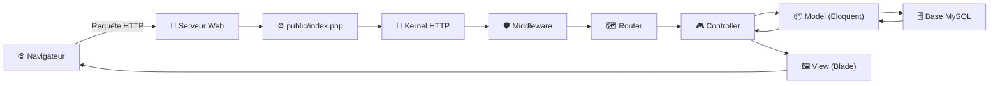
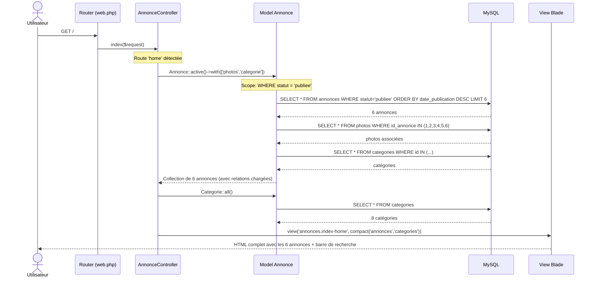
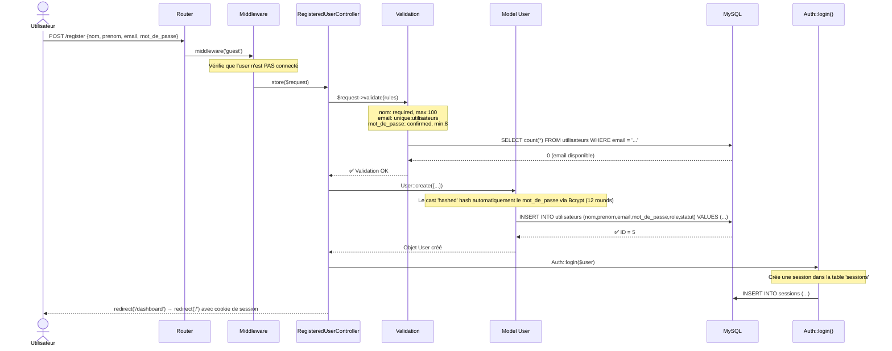
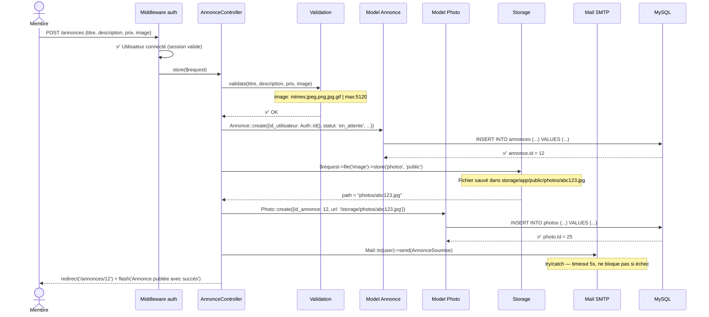
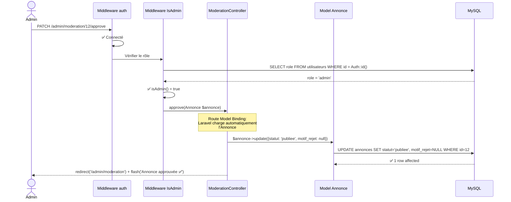
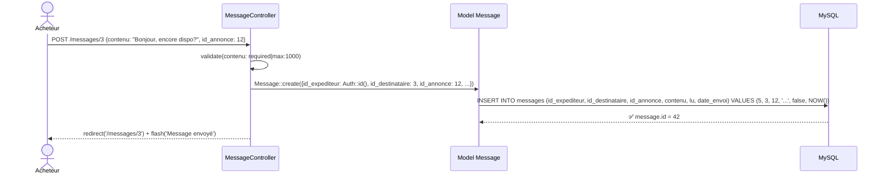
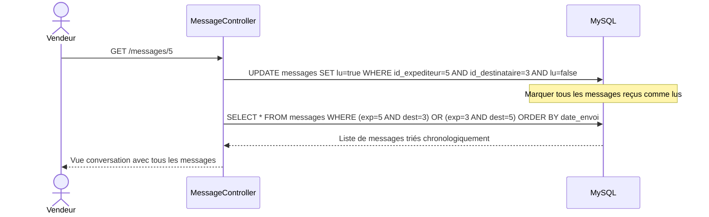
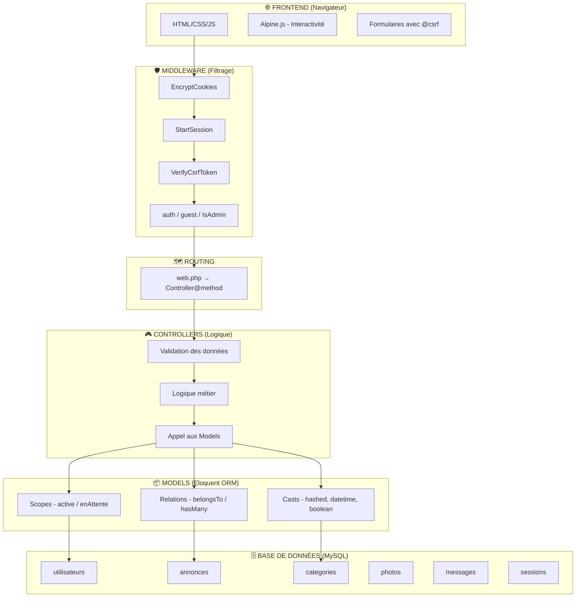

# Flux des Requêtes — MarketAd World
## De la requête HTTP jusqu'à la base de données

---

## 1. Le Cycle de Vie d'une Requête Laravel (Vue Globale)

Chaque interaction de l'utilisateur suit ce parcours :



### Étapes détaillées :

| # | Étape | Fichier | Rôle |
|---|-------|---------|------|
| 1 | **Requête HTTP** | — | Le navigateur envoie `GET /annonces` ou `POST /annonces` |
| 2 | **Point d'entrée** | `public/index.php` | Charge l'autoloader Composer et démarre Laravel |
| 3 | **Kernel HTTP** | `bootstrap/app.php` | Construit l'application, charge la config |
| 4 | **Middleware** | `app/Http/Middleware/` | Vérifie auth, CSRF, admin... **avant** le contrôleur |
| 5 | **Router** | `routes/web.php` | Fait correspondre l'URL → contrôleur + méthode |
| 6 | **Controller** | `app/Http/Controllers/` | Logique métier : validation, traitement |
| 7 | **Model (Eloquent)** | `app/Models/` | Communique avec MySQL via des requêtes SQL générées |
| 8 | **Base de données** | MySQL | Exécute le SQL, renvoie les résultats |
| 9 | **View (Blade)** | `resources/views/` | Génère le HTML avec les données du contrôleur |
| 10 | **Réponse HTTP** | — | Le HTML est renvoyé au navigateur |

---

## 2. Exemple Concret #1 : Consulter la Page d'Accueil

> L'utilisateur tape `https://marketadworld.up.railway.app/` dans son navigateur.



### Ce qui se passe dans le code :

**`routes/web.php`** :
```php
Route::get('/', [AnnonceController::class, 'index'])->name('home');
```

**`AnnonceController@index`** :
```php
$query = Annonce::active()->with(['photos', 'categorie']);
// ... filtres optionnels (recherche, catégorie, prix) ...
$annonces = $query->latest('date_publication')->take(6)->get();
return view('annonces.index-home', compact('annonces', 'categories'));
```

**`Annonce::scopeActive()`** génère :
```sql
SELECT * FROM annonces WHERE statut = 'publiee'
```

**`->with(['photos', 'categorie'])`** = **Eager Loading** → évite le problème N+1 en chargeant les relations en 2-3 requêtes au lieu de 6+6.

---

## 3. Exemple Concret #2 : Inscription d'un Utilisateur

> L'utilisateur remplit le formulaire d'inscription et clique "Créer mon compte".



### La chaîne Middleware pour `POST /register` :

```
Requête HTTP
  └─→ EncryptCookies        (déchiffre les cookies)
      └─→ StartSession      (charge la session depuis MySQL)
          └─→ VerifyCsrfToken  (vérifie le token @csrf du formulaire)
              └─→ guest middleware  (s'assure que l'user n'est pas déjà connecté)
                  └─→ RegisteredUserController@store
```

---

## 4. Exemple Concret #3 : Publier une Annonce

> Un membre connecté remplit le formulaire et soumet une annonce avec une photo.



### Le flux du fichier image :

```
Formulaire (enctype="multipart/form-data")
  → PHP reçoit le fichier temporaire
    → Laravel valide : type MIME + taille ≤ 5MB
      → $request->file('image')->store('photos', 'public')
        → Fichier copié vers : storage/app/public/photos/abc123.jpg
          → Lien symbolique : public/storage → storage/app/public
            → URL accessible : /storage/photos/abc123.jpg
              → Enregistré dans la table 'photos' avec cette URL
```

---

## 5. Exemple Concret #4 : Modération Admin

> L'admin approuve une annonce en attente.



### La double couche de protection :

```
Requête PATCH /admin/moderation/12/approve
  │
  ├─ Middleware 'auth'     → L'utilisateur est-il connecté ?         → sinon redirect /login
  │
  └─ Middleware 'IsAdmin'  → L'utilisateur a-t-il le rôle 'admin' ? → sinon 403 Forbidden
      │
      └─ ModerationController@approve → Exécute la logique
```

Si un membre essaie d'accéder à `/admin/moderation`, il reçoit une **erreur 403** :
```php
// IsAdmin.php
if (!Auth::check() || !Auth::user()->isAdmin()) {
    abort(403, 'Accès refusé. Réservé aux administrateurs.');
}
```

---

## 6. Exemple Concret #5 : Envoyer un Message

> Un membre contacte un vendeur à propos d'une annonce.



### Quand le vendeur ouvre la conversation :



---

## 7. Résumé : Les Couches de l'Application



---

## 8. Eloquent ORM — Comment le PHP Devient du SQL

Eloquent **traduit automatiquement** le PHP en requêtes SQL. Voici les correspondances exactes dans notre projet :

| Code PHP (Eloquent) | SQL Généré |
|---------------------|------------|
| `Annonce::all()` | `SELECT * FROM annonces` |
| `Annonce::active()->get()` | `SELECT * FROM annonces WHERE statut = 'publiee'` |
| `Annonce::find(12)` | `SELECT * FROM annonces WHERE id = 12 LIMIT 1` |
| `Annonce::create([...])` | `INSERT INTO annonces (...) VALUES (...)` |
| `$annonce->update(['statut' => 'publiee'])` | `UPDATE annonces SET statut = 'publiee' WHERE id = 12` |
| `$annonce->delete()` | `DELETE FROM annonces WHERE id = 12` |
| `$annonce->photos` | `SELECT * FROM photos WHERE id_annonce = 12 ORDER BY ordre` |
| `$annonce->utilisateur` | `SELECT * FROM utilisateurs WHERE id = {id_utilisateur}` |
| `Annonce::with(['photos'])->get()` | 2 requêtes : `SELECT * FROM annonces` + `SELECT * FROM photos WHERE id_annonce IN (...)` |
| `User::where('role','admin')->first()` | `SELECT * FROM utilisateurs WHERE role = 'admin' LIMIT 1` |
| `Auth::user()->annonces()->count()` | `SELECT count(*) FROM annonces WHERE id_utilisateur = {auth_id}` |

---

## 9. Le Cycle Complet en une Image

```
┌─────────────────────────────────────────────────────────────────┐
│                        NAVIGATEUR                               │
│  L'utilisateur clique "Publier une annonce"                     │
│  → Le navigateur envoie : POST /annonces + données + image     │
└──────────────────────────────┬──────────────────────────────────┘
                               │
                               ▼
┌─────────────────────────────────────────────────────────────────┐
│                     public/index.php                            │
│  Point d'entrée unique — charge Laravel                        │
└──────────────────────────────┬──────────────────────────────────┘
                               │
                               ▼
┌─────────────────────────────────────────────────────────────────┐
│                      MIDDLEWARE STACK                            │
│  1. EncryptCookies    → déchiffre les cookies                  │
│  2. StartSession      → charge la session depuis MySQL         │
│  3. VerifyCsrfToken   → vérifie le token anti-CSRF             │
│  4. auth middleware   → vérifie que l'user est connecté        │
└──────────────────────────────┬──────────────────────────────────┘
                               │
                               ▼
┌─────────────────────────────────────────────────────────────────┐
│                    ROUTER (web.php)                              │
│  POST /annonces → AnnonceController@store                      │
└──────────────────────────────┬──────────────────────────────────┘
                               │
                               ▼
┌─────────────────────────────────────────────────────────────────┐
│                 CONTROLLER (AnnonceController)                  │
│  1. $request->validate()  → valide titre, prix, image          │
│  2. Annonce::create()     → insère dans MySQL                  │
│  3. store('photos')       → sauvegarde l'image sur le disque   │
│  4. Photo::create()       → enregistre l'URL dans MySQL        │
│  5. Mail::send()          → tente d'envoyer un email           │
│  6. redirect()            → redirige vers la page de l'annonce │
└──────────────────────────────┬──────────────────────────────────┘
                               │
                        ┌──────┴──────┐
                        ▼             ▼
┌─────────────────────────┐  ┌────────────────────┐
│     MODEL (Eloquent)    │  │   STORAGE (disque)  │
│  Annonce::create()      │  │  photos/abc123.jpg  │
│  → INSERT INTO annonces │  └────────────────────┘
│  Photo::create()        │
│  → INSERT INTO photos   │
└────────────┬────────────┘
             │
             ▼
┌─────────────────────────┐
│     BASE MYSQL          │
│  annonces: id=12        │
│  photos: id_annonce=12  │
└─────────────────────────┘
             │
             ▼
┌─────────────────────────────────────────────────────────────────┐
│                      VIEW (Blade)                               │
│  show.blade.php reçoit $annonce                                │
│  → Génère le HTML avec les données                             │
│  → Renvoie la réponse HTTP 200 au navigateur                   │
└─────────────────────────────────────────────────────────────────┘
```

---

*Ce document trace le parcours complet de chaque requête dans MarketAd World — de la saisie utilisateur jusqu'à la persistance en base de données et le rendu final.*
