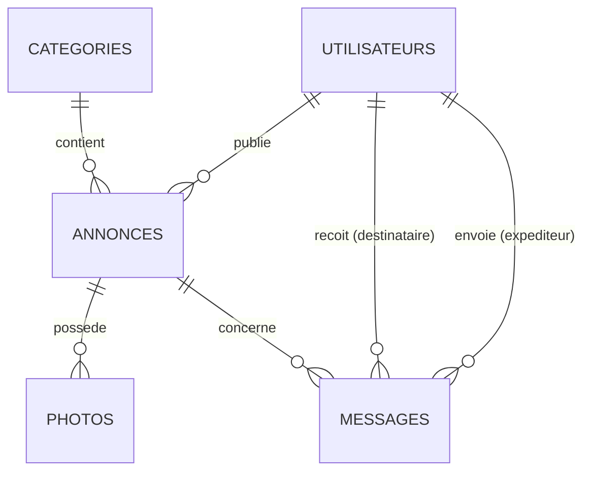

# Documentation Technique — MarketAd World
## Plateforme de Petites Annonces

---

## 1. Vue d'Ensemble du Projet

**MarketAd World** est une plateforme web de petites annonces développée avec **Laravel 12** (PHP 8.2+). Elle permet aux utilisateurs de publier, rechercher, consulter et gérer des annonces classées par catégories, avec un système de messagerie intégré et un panneau d'administration complet.

### Acteurs du Système

| Acteur | Rôle | Permissions |
|--------|------|-------------|
| **Visiteur** | Utilisateur non connecté | Consulter/rechercher des annonces, s'inscrire, se connecter |
| **Membre** | Utilisateur connecté (role=`membre`) | Publier/modifier/supprimer ses annonces, envoyer des messages, gérer son profil |
| **Administrateur** | Superutilisateur (role=`admin`) | Modérer les annonces (approuver/rejeter), gérer les utilisateurs (activer/suspendre/bannir/supprimer) |

---

## 2. Stack Technologique

### Backend

| Technologie | Version | Usage |
|-------------|---------|-------|
| **PHP** | ^8.2 | Langage serveur |
| **Laravel** | ^12.0 | Framework MVC principal |
| **Laravel Breeze** | ^2.4 (dev) | Scaffolding d'authentification |
| **Laravel Tinker** | ^2.10.1 | REPL interactif |
| **PHPUnit** | ^11.5 | Tests unitaires et fonctionnels |
| **FakerPHP** | ^1.23 | Génération de données fictives |

### Frontend

| Technologie | Version | Usage |
|-------------|---------|-------|
| **Blade** | (intégré Laravel) | Moteur de templates |
| **TailwindCSS** | ^3.1.0 | Framework CSS utilitaire (pour composants Breeze) |
| **Alpine.js** | ^3.4.2 | Micro-framework JS réactif |
| **Vite** | ^7.0.7 | Bundler d'assets |
| **Axios** | ^1.11.0 | Client HTTP |
| **Lucide Icons** | latest (CDN) | Icônes SVG dans la navigation |
| **Google Fonts (Inter)** | — | Typographie principale |

### Base de Données

| Technologie | Usage |
|-------------|-------|
| **MySQL** | Base de données principale (production/dev) |
| **SQLite** | Base de données pour les tests (en mémoire) |

### Services Externes

| Service | Usage |
|---------|-------|
| **Gmail SMTP** | Envoi d'emails (vérification, notifications) |

---

## 3. Architecture MVC

```
code/
├── app/
│   ├── Http/
│   │   ├── Controllers/         # Contrôleurs (logique métier)
│   │   │   ├── Admin/           # Contrôleurs administration
│   │   │   ├── Auth/            # Contrôleurs authentification (Breeze)
│   │   │   ├── AnnonceController.php
│   │   │   ├── MessageController.php
│   │   │   └── ProfileController.php
│   │   ├── Middleware/          # Middleware personnalisé
│   │   │   └── IsAdmin.php
│   │   └── Requests/            # Form Requests (validation)
│   ├── Mail/                    # Classes Mailable
│   ├── Models/                  # Modèles Eloquent (5 modèles)
│   ├── Policies/                # Politiques d'autorisation
│   ├── Providers/               # Service Providers
│   └── View/Components/         # Composants Blade (class-based)
├── database/
│   ├── factories/               # Model Factories
│   ├── migrations/              # 8 fichiers de migration
│   └── seeders/                 # 3 seeders (Database, Categorie, Annonce)
├── resources/views/             # Templates Blade
│   ├── admin/                   # Vues administration
│   ├── annonces/                # Vues des annonces (7 fichiers)
│   ├── auth/                    # Vues authentification (6 fichiers)
│   ├── components/              # Composants Blade (13 fichiers)
│   ├── layouts/                 # Layouts (app, guest, navigation)
│   ├── messages/                # Vues messagerie
│   └── profile/                 # Vues profil utilisateur
├── routes/
│   ├── web.php                  # Routes principales
│   └── auth.php                 # Routes d'authentification
└── config/                      # Fichiers de configuration Laravel
```

---

## 4. Schéma de Base de Données (MCD → MLD)

### 4.1 Table `utilisateurs`

```sql
CREATE TABLE utilisateurs (
    id              BIGINT UNSIGNED AUTO_INCREMENT PRIMARY KEY,
    nom             VARCHAR(100) NOT NULL,
    prenom          VARCHAR(100) NOT NULL,
    email           VARCHAR(255) UNIQUE NOT NULL,
    email_verified_at TIMESTAMP NULL,
    mot_de_passe    VARCHAR(255) NOT NULL,
    role            ENUM('visiteur','membre','admin') DEFAULT 'membre',
    statut          ENUM('actif','suspendu','banni') DEFAULT 'actif',
    date_inscription DATETIME DEFAULT CURRENT_TIMESTAMP,
    remember_token  VARCHAR(100) NULL,
    created_at      TIMESTAMP NULL,
    updated_at      TIMESTAMP NULL
);
```

> **Note :** Le champ `mot_de_passe` remplace le `password` standard de Laravel. La méthode `getAuthPassword()` est surchargée dans le modèle `User` pour le mapper.

### 4.2 Table `categories`

```sql
CREATE TABLE categories (
    id          BIGINT UNSIGNED AUTO_INCREMENT PRIMARY KEY,
    nom         VARCHAR(100) NOT NULL,
    description TEXT NULL,
    created_at  TIMESTAMP NULL,
    updated_at  TIMESTAMP NULL
);
```

**8 catégories pré-remplies** : Immobilier, Véhicules, Électronique, Emploi, Habillement, Maison & Jardin, Sports & Loisirs, Autres.

### 4.3 Table `annonces`

```sql
CREATE TABLE annonces (
    id              BIGINT UNSIGNED AUTO_INCREMENT PRIMARY KEY,
    id_utilisateur  BIGINT UNSIGNED NOT NULL REFERENCES utilisateurs(id) ON DELETE CASCADE,
    id_categorie    BIGINT UNSIGNED NOT NULL REFERENCES categories(id) ON DELETE CASCADE,
    titre           VARCHAR(255) NOT NULL,
    description     TEXT NOT NULL,
    prix            DECIMAL(10,2) NULL,
    statut          ENUM('en_attente','publiee','rejetee') DEFAULT 'en_attente',
    date_publication DATETIME DEFAULT CURRENT_TIMESTAMP,
    motif_rejet     TEXT NULL,
    created_at      TIMESTAMP NULL,
    updated_at      TIMESTAMP NULL
);
```

### 4.4 Table `photos`

```sql
CREATE TABLE photos (
    id          BIGINT UNSIGNED AUTO_INCREMENT PRIMARY KEY,
    id_annonce  BIGINT UNSIGNED NOT NULL REFERENCES annonces(id) ON DELETE CASCADE,
    url         VARCHAR(255) NOT NULL,
    nom_fichier VARCHAR(255) NOT NULL,
    ordre       INT DEFAULT 1,
    created_at  TIMESTAMP NULL,
    updated_at  TIMESTAMP NULL
);
```

### 4.5 Table `messages`

```sql
CREATE TABLE messages (
    id              BIGINT UNSIGNED AUTO_INCREMENT PRIMARY KEY,
    id_expediteur   BIGINT UNSIGNED NOT NULL REFERENCES utilisateurs(id) ON DELETE CASCADE,
    id_destinataire BIGINT UNSIGNED NOT NULL REFERENCES utilisateurs(id) ON DELETE CASCADE,
    id_annonce      BIGINT UNSIGNED NOT NULL REFERENCES annonces(id) ON DELETE CASCADE,
    objet           VARCHAR(255) NOT NULL,
    contenu         TEXT NOT NULL,
    date_envoi      DATETIME DEFAULT CURRENT_TIMESTAMP,
    lu              BOOLEAN DEFAULT FALSE,
    created_at      TIMESTAMP NULL,
    updated_at      TIMESTAMP NULL
);
```

### 4.6 Tables système (Laravel)

- `password_reset_tokens` — Stockage des tokens de réinitialisation
- `sessions` — Sessions utilisateurs (driver=database)
- `cache` / `cache_locks` — Cache applicatif (driver=database)
- `jobs` / `job_batches` / `failed_jobs` — File d'attente (driver=database)

### Diagramme des Relations



---

## 5. Modèles Eloquent — Détail

### 5.1 `User` (→ table `utilisateurs`)

| Propriété | Détail |
|-----------|--------|
| `$table` | `'utilisateurs'` |
| `$fillable` | nom, prenom, email, mot_de_passe, role, statut |
| `$hidden` | mot_de_passe, remember_token |
| **Implements** | `MustVerifyEmail` |
| **Cast** `mot_de_passe` | `'hashed'` (hashage automatique via cast) |

**Relations :**
- `annonces()` → `hasMany(Annonce, 'id_utilisateur')`
- `messagesEnvoyes()` → `hasMany(Message, 'id_expediteur')`
- `messagesRecus()` → `hasMany(Message, 'id_destinataire')`

**Helpers :**
- `isAdmin()` → vérifie `role === 'admin'`
- `isMembre()` → vérifie `role === 'membre' && statut === 'actif'`
- `getAuthPassword()` → retourne `$this->mot_de_passe` (surcharge Laravel)

### 5.2 `Annonce` (→ table `annonces`)

**Relations :**
- `utilisateur()` → `belongsTo(User, 'id_utilisateur')`
- `categorie()` → `belongsTo(Categorie, 'id_categorie')`
- `photos()` → `hasMany(Photo, 'id_annonce')` trié par `ordre`
- `messages()` → `hasMany(Message, 'id_annonce')`

**Scopes :**
- `scopeActive($query)` → filtre `statut = 'publiee'`
- `scopeEnAttente($query)` → filtre `statut = 'en_attente'`

**Helper :**
- `prixFormate()` → retourne le prix formaté en DH ou `"Prix sur demande"`

### 5.3 `Categorie`, `Photo`, `Message`

Modèles simples avec relations `belongsTo`/`hasMany` vers leurs entités parentes. `Message` cast le champ `lu` en boolean.

---

## 6. Contrôleurs — Logique Métier

### 6.1 `AnnonceController` (207 lignes)

| Méthode | Route | Description |
|---------|-------|-------------|
| `index()` | `GET /annonces` ou `GET /` | Liste les annonces publiées avec filtres (recherche texte, catégorie, prix max, tri). La page d'accueil affiche les 6 dernières ; `/annonces` paginé par 12. |
| `mesAnnonces()` | `GET /mes-annonces` | Liste les annonces de l'utilisateur connecté avec statistiques (total, actives). Filtrable par statut. |
| `create()` | `GET /annonces/create` | Affiche le formulaire de création. |
| `store()` | `POST /annonces` | Crée une annonce en statut `en_attente`, upload photo optionnel (max 5MB), envoie un email de confirmation via `AnnonceSoumise`. |
| `show()` | `GET /annonces/{annonce}` | Affiche le détail + annonces similaires (même catégorie, max 4). Vérifie que les annonces non-publiées ne sont visibles que par le propriétaire ou un admin. |
| `edit()` | `GET /annonces/{annonce}/edit` | Formulaire de modification (protégé par `Gate::authorize`). |
| `update()` | `PUT /annonces/{annonce}` | Met à jour l'annonce, repasse en `en_attente`, remplace l'image si nouvelle. |
| `destroy()` | `DELETE /annonces/{annonce}` | Supprime l'annonce et ses photos du stockage (protégé par `Gate::authorize`). |

**Validation (store/update) :**
- `titre` : required, string, max:255
- `description` : required, string
- `prix` : nullable, numeric, min:0
- `id_categorie` : required, exists:categories,id
- `image` : nullable, image, mimes:jpeg,png,jpg,gif, max:5120

### 6.2 `MessageController` (126 lignes)

| Méthode | Route | Description |
|---------|-------|-------------|
| `index()` | `GET /messages` | Affiche la boîte de réception groupée par conversation avec compteurs de messages non lus. |
| `show()` | `GET /messages/{user}` | Affiche l'historique de conversation avec un utilisateur. Marque automatiquement les messages reçus comme lus. |
| `store()` | `POST /messages/{user}` | Envoie un message. Si `id_annonce` non fourni, récupère celui du dernier message de la conversation. |

### 6.3 `Admin\ModerationController` (62 lignes)

| Méthode | Route | Description |
|---------|-------|-------------|
| `index()` | `GET /admin/moderation` | Liste toutes les annonces (tous statuts). |
| `show()` | `GET /admin/moderation/{annonce}` | Détail d'une annonce pour la modération. |
| `approve()` | `PATCH /admin/moderation/{annonce}/approve` | Passe le statut à `publiee`, supprime le motif de rejet. |
| `reject()` | `PATCH /admin/moderation/{annonce}/reject` | Passe le statut à `rejetee` avec un motif obligatoire. |
| `destroy()` | `DELETE /admin/moderation/{annonce}` | Suppression définitive. |

### 6.4 `Admin\UserController` (47 lignes)

| Méthode | Route | Description |
|---------|-------|-------------|
| `index()` | `GET /admin/users` | Liste tous les utilisateurs (sauf l'admin connecté) avec le nombre d'annonces. |
| `updateStatus()` | `PATCH /admin/users/{user}/status` | Change le statut (`actif`, `suspendu`, `banni`). |
| `destroy()` | `DELETE /admin/users/{user}` | Supprime un utilisateur (interdit pour les admins). |

### 6.5 Contrôleurs Auth (Breeze, 9 fichiers)

Tous personnalisés pour utiliser les champs français (`nom`, `prenom`, `mot_de_passe`) :

- `RegisteredUserController` — Inscription avec champs `nom`, `prenom`, `mot_de_passe`, rôle par défaut `membre`
- `AuthenticatedSessionController` — Connexion/Déconnexion
- `LoginRequest` — Validation avec `mot_de_passe` mappé vers `password` dans `Auth::attempt()`
- `PasswordResetLinkController` / `NewPasswordController` — Réinitialisation mot de passe
- `EmailVerificationPromptController` / `VerifyEmailController` — Vérification email
- `ProfileController` — Modification profil, suppression de compte

---

## 7. Système de Routage

### 7.1 Routes Publiques (Visiteur)

```
GET  /                        → AnnonceController@index  (home, 6 dernières)
GET  /annonces                → AnnonceController@index  (paginé, 12/page)
GET  /annonces/{annonce}      → AnnonceController@show
```

### 7.2 Routes Authentifiées (Membre)

```
GET    /mes-annonces              → AnnonceController@mesAnnonces
GET    /annonces/create           → AnnonceController@create
POST   /annonces                  → AnnonceController@store
GET    /annonces/{annonce}/edit   → AnnonceController@edit
PUT    /annonces/{annonce}        → AnnonceController@update
DELETE /annonces/{annonce}        → AnnonceController@destroy

GET    /messages                  → MessageController@index
GET    /messages/{user}           → MessageController@show
POST   /messages/{user}           → MessageController@store

GET    /profile                   → ProfileController@edit
PATCH  /profile                   → ProfileController@update
DELETE /profile                   → ProfileController@destroy
```

### 7.3 Routes Administration (Admin uniquement)

Protégées par `middleware(['auth', IsAdmin::class])`, préfixe `/admin` :

```
GET    /admin/moderation                      → ModerationController@index
GET    /admin/moderation/{annonce}             → ModerationController@show
PATCH  /admin/moderation/{annonce}/approve     → ModerationController@approve
PATCH  /admin/moderation/{annonce}/reject      → ModerationController@reject
DELETE /admin/moderation/{annonce}             → ModerationController@destroy

GET    /admin/users                            → UserController@index
PATCH  /admin/users/{user}/status              → UserController@updateStatus
DELETE /admin/users/{user}                     → UserController@destroy
```

### 7.4 Routes Auth (Breeze)

```
GET/POST  /register, /login, /logout
GET/POST  /forgot-password, /reset-password/{token}
GET/POST  /verify-email, /confirm-password
PUT       /password
```

---

## 8. Sécurité & Autorisation

### 8.1 Middleware `IsAdmin`

Vérifie `Auth::check()` et `Auth::user()->isAdmin()`. Retourne **403** si non-admin.

### 8.2 Policy `AnnoncePolicy`

- `update(User, Annonce)` → `$user->id === $annonce->id_utilisateur`
- `delete(User, Annonce)` → `$user->id === $annonce->id_utilisateur`

Utilisée via `Gate::authorize()` dans `edit()`, `update()`, `destroy()`.

### 8.3 Rate Limiting (Login)

`LoginRequest` implémente un rate limiter : **5 tentatives max** par combinaison email+IP. Déclenche l'événement `Lockout` au-delà.

### 8.4 Hachage des mots de passe

- **Algorithme** : Bcrypt avec **12 rounds** (`BCRYPT_ROUNDS=12`)
- **Cast automatique** : le cast `'hashed'` sur `mot_de_passe` hash automatiquement à l'écriture

### 8.5 Protection CSRF

Toutes les formes utilisent `@csrf`. Les méthodes PUT/PATCH/DELETE utilisent `@method()`.

### 8.6 HTTPS en Production

`AppServiceProvider::boot()` force HTTPS via `URL::forceScheme('https')` quand `!app()->isLocal()`.

---

## 9. Système d'Email

### Configuration SMTP

- **Mailer** : SMTP via Gmail (`smtp.gmail.com:587`, TLS)
- **From** : `yazidalaoui123456789@gmail.com` sous le nom `MarketAdWorld`

### Mailable `AnnonceSoumise`

Envoyé après la création d'une annonce. Contient un email HTML inline confirmant la soumission et informant que l'annonce est en attente de modération. L'envoi est enveloppé dans un `try/catch` pour éviter les erreurs bloquantes.

### Vérification d'Email

Le modèle `User` implémente `MustVerifyEmail`. L'événement `Registered` déclenche l'envoi automatique de l'email de vérification (également protégé par `try/catch`).

---

## 10. Gestion des Fichiers & Images

### Upload

- **Stockage** : disque `public` de Laravel (`storage/app/public/photos/`)
- **Lien symbolique** : `public/storage` → `storage/app/public`
- **Validation** : types `jpeg,png,jpg,gif`, taille max `5 Mo`
- **URL stockée** : `/storage/photos/{filename}` dans la table `photos`

### Suppression

Lors de la suppression d'une annonce ou du remplacement d'une image, les fichiers physiques sont supprimés via `Storage::disk('public')->delete()`.

---

## 11. Frontend & Design

### Architecture des Vues

Le projet utilise **deux layouts** :

1. **`layouts/app.blade.php`** — Layout principal avec navigation complète, footer, et ~300 lignes de CSS inline définissant le design system.
2. **`layouts/guest.blade.php`** — Layout minimaliste pour les pages d'auth.

Les pages d'auth (`login.blade.php`, `register.blade.php`) sont des pages HTML complètes autonomes avec leur propre CSS inline.

### Design System (Variables CSS)

```css
--bg-color: #f8fafc        /* Fond général */
--surface-color: #ffffff   /* Cartes/surfaces */
--primary: #4f46e5         /* Indigo principal */
--primary-hover: #4338ca   /* Indigo hover */
--text-main: #0f172a       /* Texte principal */
--text-muted: #64748b      /* Texte secondaire */
--danger: #ef4444          /* Rouge erreur */
--success: #10b981         /* Vert succès */
--font-main: 'Inter'       /* Police principale */
```

### Composants UI Principaux

- **Navigation** sticky avec glassmorphism (`backdrop-filter: blur`)
- **Dropdown utilisateur** au hover avec icônes Lucide
- **Cartes d'annonces** avec hover `translateY(-6px)` + shadow
- **Formulaires** avec focus states (border + box-shadow)
- **Modals** (rejet d'annonce) avec overlay et JS vanilla
- **Badges de statut** colorés (publiée/en_attente/rejetée)
- **File upload** avec zone drag-and-drop stylisée
- **Flash messages** success/error avec couleurs distinctes

### Responsive

Media queries à `900px` pour le passage en colonne unique sur la page de détail.

---

## 12. Seeders & Données de Test

### `DatabaseSeeder`

Exécution séquentielle :
1. `CategorieSeeder` — Insère 8 catégories
2. Crée un **admin** (`admin@annonces.ma` / `password123`)
3. Crée un **membre** (`membre@annonces.ma` / `password123`)
4. `AnnonceSeeder` — Insère 11 annonces exemples avec photos

### `AnnonceSeeder`

11 annonces réalistes couvrant : Immobilier (2), Électronique (3), Maison & Jardin (5), Véhicules (1). Les images proviennent du dossier `Pictures/` à la racine du repo. Toutes créées en statut `publiee`.

---

## 13. Tests

### Configuration PHPUnit

- **Base de test** : SQLite en mémoire (`:memory:`)
- **Mail** : driver `array` (pas d'envoi réel)
- **Session/Cache** : driver `array`
- **Queue** : synchrone

### Tests existants

- `tests/Feature/ExampleTest.php` — Test basique
- `tests/Feature/ProfileTest.php` — Tests du profil utilisateur
- `tests/Feature/Auth/` — Tests d'authentification (Breeze)
- `tests/Unit/ExampleTest.php` — Test unitaire basique
- `test_mcd.php` — Script de validation manuelle du MCD (crée/teste/supprime des entités)

---

## 14. Configuration Environnement

| Variable | Valeur | Description |
|----------|--------|-------------|
| `DB_CONNECTION` | `mysql` | SGBD principal |
| `DB_DATABASE` | `petites_annonces` | Nom de la base |
| `SESSION_DRIVER` | `database` | Sessions en BDD |
| `QUEUE_CONNECTION` | `database` | Files d'attente en BDD |
| `CACHE_STORE` | `database` | Cache en BDD |
| `MAIL_MAILER` | `smtp` | Email via SMTP Gmail |
| `BCRYPT_ROUNDS` | `12` | Rounds de hachage |

---

## 15. Correspondance UML ↔ Code

| Cas d'utilisation (Diagramme) | Implémentation |
|-------------------------------|----------------|
| S'inscrire | `RegisteredUserController@create/store` + `register.blade.php` |
| Se connecter | `AuthenticatedSessionController@create/store` + `login.blade.php` |
| Réinitialiser mot de passe | `PasswordResetLinkController` + `NewPasswordController` |
| Rechercher des annonces | `AnnonceController@index` avec paramètres `q`, `categorie`, `prix_max` |
| Appliquer des filtres | Paramètres GET dans `AnnonceController@index` (catégorie, prix, tri) |
| Consulter les annonces | `AnnonceController@index` (route `home` ou `annonces.index`) |
| Voir les détails | `AnnonceController@show` + `show.blade.php` |
| Publier une annonce | `AnnonceController@create/store` + `_form.blade.php` |
| Ajouter des photos | Upload dans `AnnonceController@store` (inclus dans le formulaire) |
| Gérer ses annonces | `AnnonceController@mesAnnonces` + `mes-annonces.blade.php` |
| Modifier une annonce | `AnnonceController@edit/update` + `_form.blade.php` |
| Supprimer une annonce | `AnnonceController@destroy` (confirmation JS) |
| Contacter annonceur | `MessageController@show/store` + `messages/show.blade.php` |
| Modérer les annonces | `Admin\ModerationController` + `admin/moderation/` views |
| Gérer les utilisateurs | `Admin\UserController` + `admin/users/index.blade.php` |
| Système d'Email | `AnnonceSoumise` Mailable + événement `Registered` (vérification) |

---

## 16. Inventaire Complet des Fichiers

### Modèles (5)
`User.php`, `Annonce.php`, `Categorie.php`, `Message.php`, `Photo.php`

### Contrôleurs (13)
`AnnonceController`, `MessageController`, `ProfileController`, `Admin\ModerationController`, `Admin\UserController`, + 8 contrôleurs Auth Breeze

### Migrations (8)
`create_users_table`, `create_cache_table`, `create_jobs_table`, `create_categories_table`, `create_annonces_table`, `create_photos_table`, `create_messages_table`, `add_photo_profil_to_utilisateurs_table` (vide)

### Vues Blade (35+)
- **Annonces** : `index.blade.php`, `index-home.blade.php`, `show.blade.php`, `_form.blade.php`, `create.blade.php`, `edit.blade.php`, `mes-annonces.blade.php`
- **Auth** : `login`, `register`, `forgot-password`, `reset-password`, `verify-email`, `confirm-password`
- **Admin** : `moderation/index`, `users/index`
- **Messages** : `index`, `show`
- **Profile** : `edit` + 3 partials
- **Layouts** : `app`, `guest`, `navigation`
- **Components** : 13 composants Blade (boutons, inputs, dropdown, modal, etc.)

---

*Document généré le 10/05/2026 — Projet MarketAd World par Yazid et Nawar*
